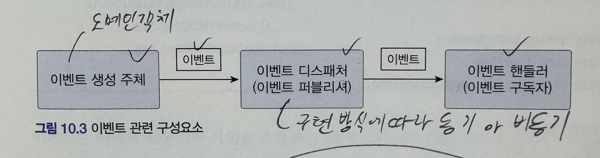
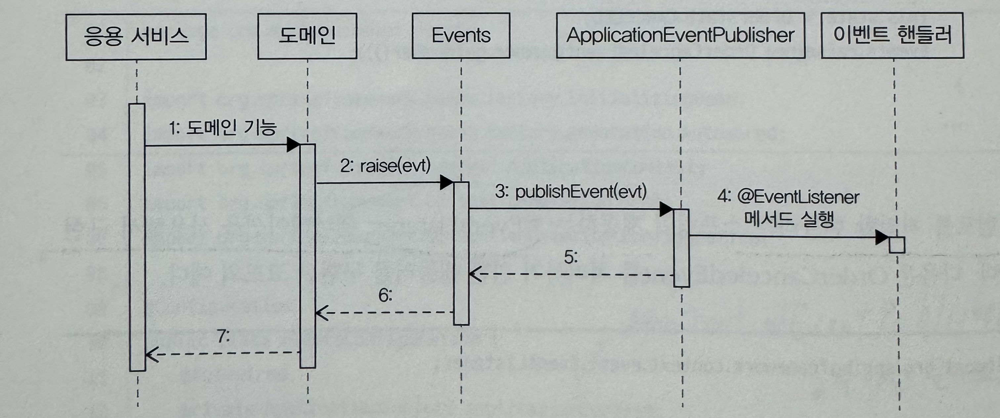
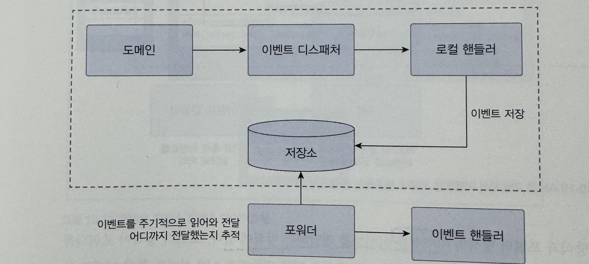

# 10장 이벤트

### 시스템 간 강결합 문제

주문에서 주문 취소를 예시로 보자

```java
public void cancel(RefundService refundService) {
	verifyNotYetShipped(); //주문 로직
	...
	try {
		refundSvc.refund(getPaymentId()); // 결제 로직
	}
	catch(Exception e) {

	}
	...
}
```

- 주문 도메인에서 다른 도메인 관련 로직이 섞이는 문제
- 외부 서비스(refundSvc)에서 에외가 발생한다면?
  - 트랜잭션으로 롤백한다?
  - 결제로직만 재시도한다?
  - 이런 문제를 통해 외부 서비스 성능에 직접적인 영향을 받는다

### 이벤트 필요성

- 주문 바운디드 컨텍스트와 결제 바운디드 컨텍스트 간의 강결합 때문이다
- 이런 강결합을 없앨 수 있는 방법은 이벤트를 사용하는 것이다
- 특히 비동기 이벤트를 사용하면 두 시스템 간의 결합을 크게 낮출 수 있다

### 이벤트

- 이벤트라는 용어는 과거에 벌어진 어떤 것을 의미한다
  - 이벤트 발생
  - 이벤트에 반응하여 동작 수행

### 이벤트 관련 구성요소

<p align="left">
    
</p>

- 이벤트 생성 주체
  - 엔티티, 벨류, 도메인 서비스와 같은 도메인 객체
  - 도메인 객체는 도메인 로직을 실행해서 상태가 바뀌면 이벤트를 발생시킨다
  - 이벤트는 디스패처로 전달한다
- 이벤트 디스패처
  - 이벤트를 전달받은 디스패처는 해당 이벤트를 처리할 수 있는 핸들러에 이벤트를 전파한다
  - 구현 방식에 따라 동기, 비동기로 처리한다
- 이벤트 핸들러
  - 이벤트 생성 주체가 발생한 이벤트에 반응한다
  - 예를들어 주문 취소됨 이벤트를 받은 이벤트 핸들러는 해당 주문의 주문자에게 SMS로 주문 취소 사실을 통지한다

### 이벤트의 구성

이벤트는 발생한 이벤트에 대한 정보를 담는다

- 이벤트 종류 : 클래스 이름으로 이벤트 종류를 표현
- 이벤트 발생 시간
- 추가 데이터 : 주문번호, 신규 배송지 정보 등 이벤트와 관련된 정보

### 이벤트의 용도

1. 트리거
   - 도메인 상태가 바뀔 때 다른 후처리가 필요하면 후처리를 실행하기 위한 트리거로 이벤트를 사용
2. 데이터 동기화
   - 배송지를 변경하면 외부 배송 서비스에 바뀐 배송지 정보를 전송해야한다.
   - 주문 도메인은 배송지 변경 이벤트를 발생시키고 이벤트 핸들러는 외부 배송 서비스와 배송지 정보를 동기화한다

### 이벤트 적용 예시

```java
public void cancel() {
	verifyNotYetShipped(); //주문 로직
	Events.raise(new OrderCanceledEvent(number.getNumber())); //취소 이벤트 발생
}
```

이를 통해 서로 다른 도메인 로직이 섞이는 것을 방지할 수 있다

### 이벤트, 핸들러, 디스패처 구현

- 이벤트 클래스 : 이벤트를 표현한다
- 디스패처 : 스프링이 제공하는 ApplicationEventPublisher를 사용한다
- Events : 이벤트를 발행한다 이벤트 발행을 위해 ApplicationEventPublisher를 사용한다
- 이벤트 핸들러 : 이벤트를 수신해서 처리한다 스프링이 제공하는 기능을 사용한다

### 이벤트 클래스

모든 이벤트가 공통으로 갖는 프로퍼티가 존재한다면 관련 상위 클래스를 만들 수 있다.

```java
package com.myshop.common.event;

public abstract class Event {
	private long timestamp;

	public Event() {
		this.timestamp = System.currentTimeMillis();
	}
	...
}
```

발생 시간이 필요한 이벤트 클래스는 Event 클래스를 상속받아 구현하면 된다

```java
public class OrderCanceledEvent extends Event{
	//이벤트 핸들러에서 처리하는 데 필요한 데이터를 포함
	private String orderNumber;

	public OrderCanceledEvent(String number) {
		super();
		this.orderNumber = number;
	}

	public String getOrderNumber() { return orderNumber;}
}
```

- 이벤트 클래스의 이름을 결정할 때는 과거 시제를 사용한다
- Event를 사용해서 이벤트로 사용하는 클래스를 명시적으로 표현할 수도 있고 OrderCanceled 처럼 간결하게 작성할 수도 있다

### Events 클래스와 ApplicationEventPublisher

이벤트 발생과 출판을 위해 스프링이 제공하는 ApplicationEventPublisher를 사용

```java
@Configuration
public class EventsConfiguration {
	@Autowried
	private ApplicationContext applicationContext;

	@Bean
	public InitializingBean eventsInitializer() {
		return () -> Events.setPublisher(applicationContext);
	}
}
```

```java
public class Events {
	private static ApplicationEventPublisher publisher;

	static void setPublisher(ApplicationEventPublisher publisher) {
		Events.publisher = publisher;
	}

	public static void raise(Object event) {
		if(publisher != null) {
			publisher.publishEvent(event);
		}
	}
}
```

Events는 ApplicationEventPublisher를 사용해서 이벤트 발생

### 이벤트 발생과 이벤트 핸들러

```java
//이벤트 발생
public class Order {
	public void cancel() {
		...
		Events.raise(new OrderCanceledEvent(number.getNumber()));
	}
}
```

```java
@Service
public class OrderCanceledEventHandler {
	private RefundService refundService;

	public OrderCanceledEventHandler(RefundService refundService) {
		this.refundService = refundService;
	}

	@EventListener(OrderCanceledEvent.class)
	public void handle(OrderCanceledEvent event) {
		refundService.refund(event.getOrderNumber());
	}
}
```

이벤트를 처리할 핸들러는 스프링이 제공하는 @EventListener 어노테이션을 사용한다

### 흐름 정리

<p align="left">
    
</p>

### 동기 이벤트 처리 문제

이벤트를 사용해서 강결합 문제는 해소했지만 이벤트에서 느려지거나 예외가 발생한다면?

바로 외부 서비스에 영향을 받는 문제이다

해결 방법은

1. 이벤트를 비동기로 처리한다
2. 이벤트와 트랜잭션을 연계하는 방법

### 비동기 이벤트 처리

요구사항중에는 A하면 언제까지 B하라 인 경우가 많다 즉, 일정 시간 안에만 후속 처리를 처리하면 되는 경우가 많다

A하면 B하라는 요구사항에서 B를 하는데 실패하면 일정 간격으로 재시도를 하거나 수동처리를 해도 상관없는 경우가 있다

비동기 처리 방식의 4가지를 살펴본다

1. 로컬 핸들러로 비동기로 실행하기
2. 메시지 큐를 사용하기
3. 이벤트 저장소와 이벤트 포워더 사용하기
4. 이벤트 저장소와 이벤트 제공 API 사용하기

### 1) 로컬 핸들러 비동기 실행

- 이벤트 핸들러를 별도 스레드로 실행하는 것이다
- 스프링은 @Async 어노테이션으로 비동기 이벤트 핸들러를 실행할 수 있다

```java
@SpringBootApplication
@EnableAsync //기능 활성화
public class ShopApplication {
	public static void main(String[] args) {
		SpringApplication.run(ShopApplication.class, args);
	}
}
```

```java
//핸들러
@Service
public class OrderCanceledEventHandler {

	@Async
	@EventListener(OrderCanceledEvent.class)
	public void handle(OrderCanceledEvent event) {
		refundService.refund(event.getOrderNumber());
	}
}
```

### 2) 메시징 시스템을 이용한 비동기 구현

카프카나 레빗MQ와 같은 메시징 시스템을 사용

- 레빗 MQ
  - 글로벌 트랜잭션 지원
    - 안전하게 이벤트를 메시지 큐에 전달할 수 있는 장점이 있지만
    - 반대로 글로벌 트랜잭션으로 인해 성능이 떨어지는 단점도 있다
  - 클러스터와 고가용성을 지원하기 때문에 안정적으로 메시지를 전달
- 카프카
  - 글로벌 트랜잭션 지원 X
  - 다른 메시징 시스템에 비해 높은 성능

### 메시징 큐 사용시 한가지 주의점

- 메시지 큘르 사용하면 보통 이벤트 발생시키는 주체와 이벤트 핸들러가 별도 프로세스에서 동작한다
- 이것은 이벤트 발생 JVM과 이벤트 처리 JVM이 다르다는 것을 의미한다
- 물론 같은 JVM에서 이벤트를 주고받을 수 있지만 동일 JVM에서 비동기 처리를 위해 메시지 큐를 사용하는 것은 시스템을 복잡하게 만든다

### 3, 4 ) 이벤트 저장소를 이용한 비동기 처리

- 이벤트를 일단 DB에 저장한 뒤에 별도 프로그램을 이용해서 이벤트 핸들러에 전달

<p align="left">
    
</p>

1. 이벤트가 발생하면 핸들러는 스토리지에 이벤트를 저장
2. 포워더는 주기적으로 이벤트 저장소에서 이벤트를 가져와 이벤트 핸들러를 실행
3. 포워더는 별도 스레드를 이용하기 때문에 이벤트 발행과 처리가 비동기로 처리된다

- 도메인 상태와 이벤트 저장소로 동일한 DB를 사용한다
- 즉, 도메인의 상태 변화와 이벤트 저장이 로컬 트랜잭션으로 처리된다

- API 방식 역시 포워더 방식과 마찬가지로 이벤트 저장소에서 외부 핸들러가 API 서버를 통해 이벤트 목록을 가져간다

정리하자면

- 포워더
  - 포워더를 이용해서 이벤트를 외부에 전달
  - 이벤트를 어디까지 처리했는지 추적하는 역할이 포워더에있다
- API
  - 외부 핸들러가 API 서버를 통해 이벤트 목록을 가져간다
  - 이벤트를 어디까지 처리했는지 추적하는 역할이 외부 핸들러에 있다

### 이벤트 저장소

- EventEntry : 이벤트 저장소에 보관할 데이터
  - EventEntry는 이벤트를 식별하기 위한 id, 이벤트 타입인 type, 직렬화한 데이터 형식인 contentType, 이벤트 데이터 자체인 payload, 이벤트 시간인 timestamp
- EventStore : 이벤트를 저장하고 조회하는 인터페이스를 제공
- JdbcEventStore : JDBC를 이용한 EventStore 구현 클래스
- EventApi : REST API를 이용해서 이벤트 목록을 제공하는 컨트롤러

### 이벤트 적용 시 추가 고려사항

1. 이벤트 소스를 EventEntry에 추가할지?
   - EventEntry는 이벤트 발생 주체에 대한 정보를 갖지 않는다
   - 특정 주체가 발생시킨 이벤트만 조회하는 기능을 구현하려면 발생 주체 정보를 포함해야한다

1. 포워더에서 전송 실패를 얼마나 허용할지?
   - 이벤트 전송에 실패한 이벤트부터 다시 읽어와 전송을 시도한다
   - 하지만 특정 이벤트에서 계속 실패한다면?
   - 이렇게 되면 해당 이벤트 때문에 나머지 이벤트도 전송할 수 없게된다
   - 이럴경우 실패한 이벤트의 재전송 횟수 제한을 두거나
   - 실패한 이벤트는 실패용 DB나 메시지 큐에 저장해야한다

1. 이벤트 손실
   - 이벤트 저장소를 사용하면 이벤트 발생과 저장을 한 트랜잭션에서 처리하기 때문에 트랜잭션에 성공하면 이벤트가 저장소에 보관된다는 것을 보장할 수 있다
   - 이벤트를 비동기로 처리할 경우 이벤트 처리에 실패하면 이벤트를 유실하게 된다

1. 이벤트 순서
   - 이벤트 발생 순서대로 외부 시스템에 전달해야 할 경우 이벤트 저장소를 사용하는 것이 좋다
   - 메시징 시스템은 사용 기술에 따라 이벤트 발생 순서와 메시지 전달 순서가 다를 수 있다

1. 이벤트 재처리
   - 동일 이벤트를 다시 처리해야 할때 순번을 기억한뒤 이미 처리된 이벤트 처리 방식과
   - 멱등성을 이용하여 처리한다

### 이벤트 처리와 DB 트랜잭션 고려

- 이벤트 처리를 동기로 하든 비동기로 하든 이벤트 처리 실패와 트랜잭션 실패를 함께 고려해야 한다
- 트랜잭션 실패와 이벤트 처리 실패 모두 고려하면 복잡해지므로 경우의 수를 줄이면 도움이 된다
- 경우의 수를 줄이는 방법은 트랜잭션이 성공할 때만 이벤트 핸들러를 실행하는 것이다

```java
@TransactionalEventListener(
	classes = OrderCanceledEvent.class,
	phase = TransactionalPhase.AFTER_COMMIT
)
public void handle(OrderCanceledEvent event) {
	refundService.refund(event.getOrderNumber());
}
```

- 스프링은 `@TransactionalEventListener` 어노테이션을 지원한다.
- 이 어노테이션은 트랜잭션 상태에 따라 이벤트 핸들러를 실행할 수 있게 한다
- `TransactionalPhase.AFTER_COMMIT` 속성은 트랜잭셩이 성공한 뒤에 핸들러 메서드를 실행한다
