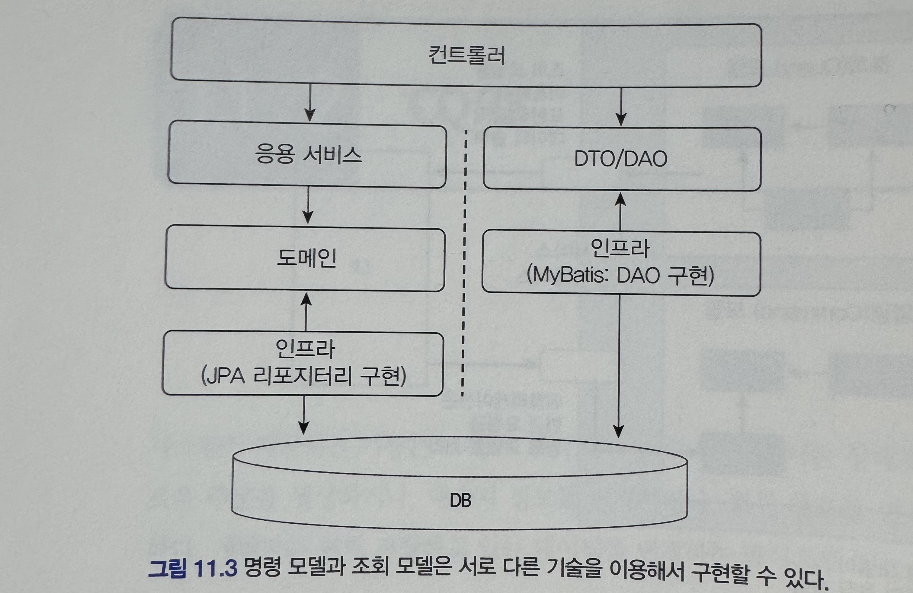
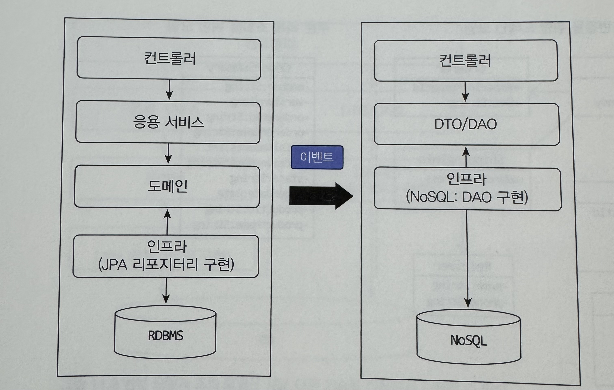

# 11장 CQRS

### 단일 모델의 단점

조회 기능을 구현할 때 여러 애그리거트에서 데이터를 가져와야 할 경우가 많다.

이때 여러 애그리거트에서 데이터를 가져와 출력하는 기능을 구현하기에는 고려할게 많아서 복잡하게 만드는 원인이 된다

- 식별자를 이용해서 참조하는 방식의 경우 한번의 SELECT 쿼리로 조회화면에 한번에 필요한 데이터를 읽어올 수 없어 조회 성능에 문제가 생길 수 있다
- 참조 방식으로 연결해도 즉시로딩이나 지연로딩으로 처리해야 하기 때문에 DBMS가 제공하는 전용기능이 필요하면 JPA의 네이티브 쿼리를 사용해야 할 수도 있다

### CQRS (Command Query Responsibility Segregation)

명령(Command)(시스템 데이터 변경) 역할을 수행하는 구성요소와(responsibility)와

쿼리(Query)(시스템 데이터 조회) 역할을 수행하는 구성요소를 나누는 것(Segregation)이 CQRS이다

상태를 변경하는 범위와 상태를 조회하는 범위가 정확하게 일치하지 않기 떄문에 단일 모델로 두 종류의 기능을 모두 구현하면 모델이 불필요하게 복잡해진다

단일 모델을 사용할 떄 발생하는 복잡도를 해결하기 위해 사용하는 방식이 CQRS이다

### CQRS를 사용시

CQRS를 사용하면 각 모델에 맞는 구현 기술을 선택할 수 있다

- 명령 모델은 객체 지향에 기반해서 도메인 모델을 구현하기에 적당한 JPA를 사용하고
- 조회 모델은 DB테이블에서 SQL로 데이터를 조회할 때 좋은 마이바티스를 사용해서 구현하면 된다

    

- 조회 모델의 경우 단순히 데이터를 읽어와 조회하는 기능은 응용 로직이 복잡하지 않기 때문에 컨트롤러에서 바로 DAO를 실행해도 무방하다
- 물론 데이터를 표현 영역에 전달하는 과정에서 몇 가지 로직이 필요하다면 응용 서비스를 두고 로직을 구현하면 된다

### CQRS 사용하면 각 모델에 맞는 데이터 저장소를 선택할 수 있다

    

명령 모델은 트랜잭션을 지원하는 RDBMS를 사용하고 조회 모델은 조회 성능이 좋은 메모리 기반 NoSQL을 사용할 수 있다

명령 모델에서 데이터가 바뀌자마자 변경 내역을 바로 조회 모델에 반영해야 한다면 동기 이벤트와 글로벌 트랜잭션을 사용해서 실시간으로 동기화할 수 있다

### 웹과 CQRS

- 일반적인 웹 서비스는 상태를 변경하는 요청보다 상태를 조회하는 요청이 많다
- 대규모 트래픽이 발생하는 웹 서비스는 알게 모르게 CQRS를 적용하게 된다
- 조회 속도를 높이기 위해 별도 처리를 하고 있다면 CQRS를 적용하자
- 이를 통해 조회기능 때문에 명령 모델이 복잡해지는 것을 막을 수 있고, 명령 모델에 관계없이 조회 기능에 특화된 구현 기법을 보다 쉽게 적용할 수 있다

### CQRS 장단점

- 장점
  - 명령 모델을 구현할 때 도메인 자체에 집중할 수 있다
  - 조회 성능 향상에 유리
- 단점
  - 구현해야 할 코드가 더 많다
  - 더 많은 구현 기술이 필요하다

장단점을 고려해 CQRS 패턴 도입 여부를 결정한다

도메인이 복잡하지 않은데 CQRS를 도입하면 유지 비용만 높아진다

반면 트래픽이 높은 서비스인데 단일 모델을 고집하면 유지 보수 비용이 오히려 높아질 수 있으므로 CQRS 도입을 고려한다
