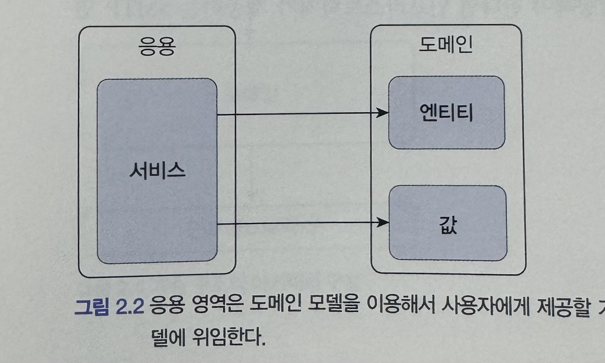
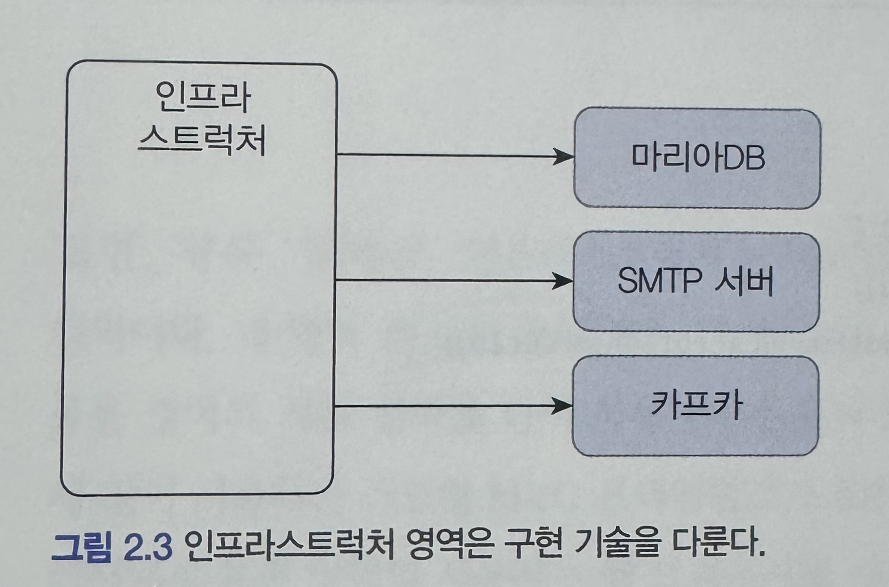
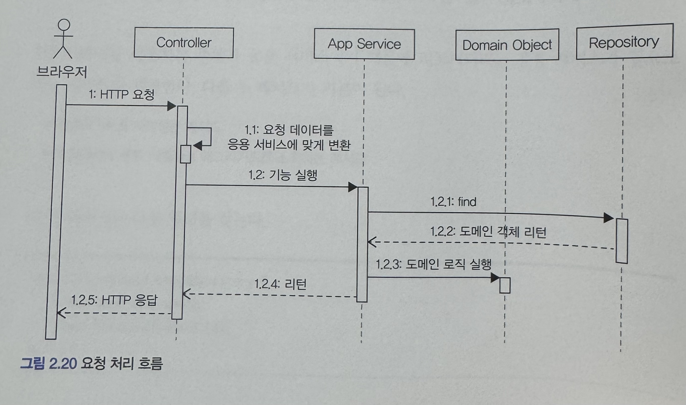
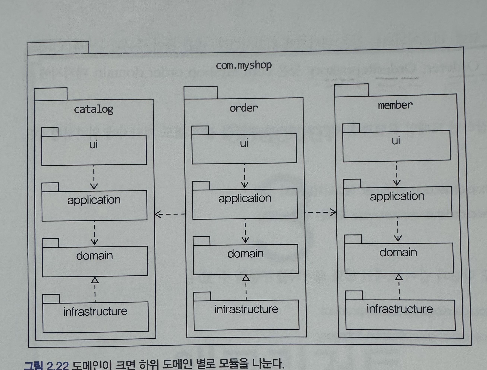

# 2장 아키텍처 개요

### 전형적인 4가지 영역

표현, 응용, 도메인, 인프라스트럭처

### 표현

- 사용자의 요청을 받아 응용 영역에 처리 결과를 전달하고 결과를 다시 사용자에게 보내주는 역할

    

### 응용

- 표현 영역을 통해 요청을 받아 시스템이 사용자에게 제공해야 할 기능을 구현하는 역할
- 로직을 직접 수행하기 보다는 도메인 모델에 로직 수행을 위임한다.

    

### 도메인

- 도메인의 핵심 로직을 구현한다.

### 인프라스트럭처

- 구현 기술에 대해 다룬다. 논리적인 개념을 표현하기보다는 실제 구현을 다룬다.

    

### 계층형 아키텍처

상위 계층에서 하위 계층으로 의존만 존재하고 하위 계층에서 상위 계층에 의존하지 않는다.

### DIP(Dependency Inversion Principle) 의존성 역전 원칙

DIP를 잘못 생각하면 단순히 인터페이스와 구현 클래스를 분리하는 정도로 받아들일 수 있다.

하지만 **DIP의 핵심**은 **고수준 모듈이 저수준 모듈에 의존하지 않도록** 하기 위함이다.

- 여기서 잠시 고수준 모듈과 저수준 모듈이란?
  - 가격 할인 계산이라는 서비스를 예시로 그 안에는
  1. 고객 정보를 구한다.
  2. 규칙을 이용해서 할인 금액을 구한다.
  - 2가지 기능이 있다고 할때
    1-1 고객 정보를 구하는건 RDBMS에서 데이터를 가져오고
    2-1 규칙기반으로 할인 금액을 정한다.
    이와 같이 여러 하위 기능이 존재하게 되는데
    하위 기능(1, 2)을 저수준 모듈
    가격 할인 계산을 고수준 모듈이라 한다.

### 도메인 영역의 주요 구성요소

| 요소          | 정의                                                  |                                                                                                                                                                                      |
| ------------- | ----------------------------------------------------- | ------------------------------------------------------------------------------------------------------------------------------------------------------------------------------------ |
| 엔티티        | 고유의 식별자를 갖는 객체                             | 단순히 데이터를 담는 구조라기 보다는 데이터와 함께 기능을 제공하는 객체                                                                                                              |
| 벨류          | 고유의 식별자를 갖지 않는 객체                        | Orderer와 같은 밸류 타입을 사용하여 표현할 수 있다. 불변으로 구현할 것을 권장한다! → 이를 통해 밸류 타입을 변경할 때는 기존 객체의 값을 변경하지 않고 새로운 객체를 필드에 할당한다. |
| 애그리거트    | 연관된 엔티티와 밸류 객체를 개념적으로 하나로 묶은 것 | 규모가 커질수록 도메인 모델의 구성요소는 복잡해진다. 이를 해결하기 위해 관련객체를 하나로 묶는 군집이다.                                                                             |
| 리포지토리    | 도메인 모델의 영속성을 처리한다                       | 엔티티나 밸류가 요구사항에서 도출되는 도메인 모델이라면 리포지토리는 구현을 위한 도메인 모델이다.                                                                                    |
| 도메인 서비스 | 특정 엔티티에 속하지 않은 도메인 로직을 제공한다.     | 여러 개념(엔티티/값 객체)가 함께 등장하는 도메인 규칙을 표현할때 도메인 서비스를 사용한다.                                                                                           |

### 요청 처리 흐름

    

표현 영역 : 사용자가 전송한 데이터 형식을 검사하고 데이터를 응용 서비스에 기능 실행을 위임

응용 서비스 : 도메인 모델을 이용하여 기능을 구현한다.

이때 기능 구현에 필요한 도메인 객체를 리포지토리에서 가져와 실행하거나 신규 도메인 객체를 생성해서 리포지토리에 저장한다.

### 모듈 구성

    

- 도메인 모듈은 도메인에 속한 애그리거트를 기준으로 다시 패키지를 구성한다.
- 모듈 구조를 얼마나 세분화해야 하는지 정해진 규칙은 없다.
- 하지만 한 패키지에 너무 많은 타입이 몰려서 코드를 찾을 떄 불편한 정도만 아니면 된다.
