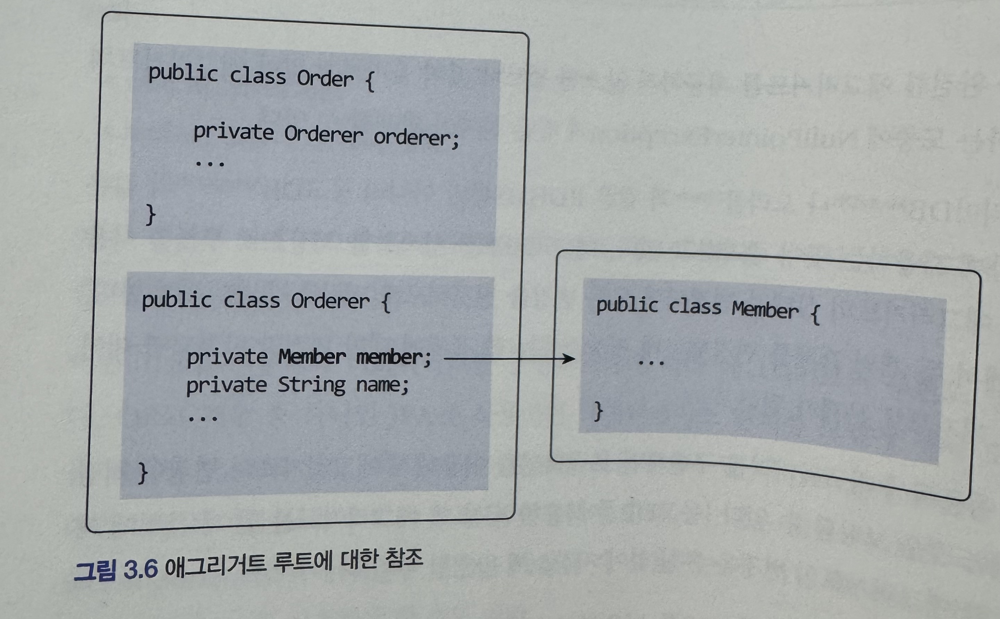
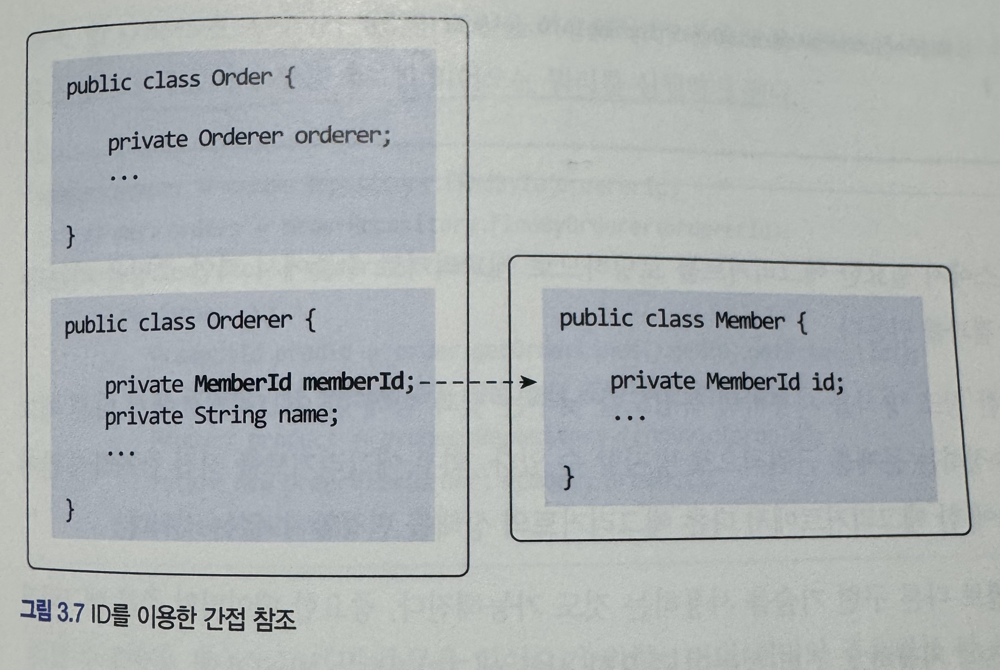

# 3장 애그리거트

### 애그리거트

주요 도메인 요소 간의 관계를 파악하기 어렵다는 것은 코드를 변경하고 확장하는 것이 어려워진다는 것이다.

이를 해결하기 위해 애그리거트는 관련된 객체를 하나의 군으로 묶는다.

이를 통해 모델 간의 관계를 개별 모델 수준과 상위 수준에서 모두 이해할 수 있다.

### 애그리거트 루트

- 애그리거트에 속한 모든 객체가 일관된 상태를 유지하려면 애그리거트 전체를 관리할 주체가 필요한데 이 책임을 지는 것이 바로 애그리거트 루트이다.
- 애그리 거트에 속한 객체는 애그리거트 루트 엔티티에 직접 또는 간접적으로 속하게 된다.
- 애그리거트 루트의 핵심 역할은 애그리거트의 일관성이 깨지지 않도록 하는 것이다.

### 도메인 규칙과 일관성

- 애그리거트 외부에서 애그리거트에 속한 객체를 직접 변경하면 안된다.
- 단순히 필드를 변경하는 set메서드를 공개(public)범위로 만들지 않는다.
- 밸류 타입은 불변으로 한다.

### 트랜잭션 범위

- 범위는 작을수록 좋다.
- 한 트랜잭션안에서 하나의 애그리거트만 수정한다.
- 만약 2개 이상의 애그리거트를 수정해야한다면 애그리거트에서 다른 애그리거트를 수정하지 말고 응용서비스에서 애그리거트를 수정하도록 해야한다.

# 리포지토리와 애그리거트

### 필드 참조

- 애그리거트도 다른 애그리거트를 참조한다.
- 애그리거트 참조는 애그리거트 루트가 다른 애그리거트 루트를 참조한다는 뜻이다.
<p align="left">
    
</p>

필드 참조 방식의 문제점

- 편한 탐색 오용
- 결합도 증가
- 성능에 대한 고민
- 확장 어려움

### ID를 통한 참조

<p align="left">
    
</p>

ID 참조 장점

- 모델의 복잡도를 낮춘다
- 응집도 증가
- 구현 난이도 감소
- 확장 용이

### ID 참조시 주의사항

ID를 이용한 조회는 N+1 문제가 발생한다.

해결 방법

- 조회 전용 쿼리를 만들어 사용한다.
- 쿼리가 복잡하거나 특화된 기능을 사용해야 한다면 마이바티스와 같은 기술로 구현하는걸 고려한다.

### 잠시 N+1 문제란?

1번의 조회 쿼리 후, 조회된 N개의 결과 각각에 대해 추가로 N번의 쿼리가 발생하는 문제

예시코드

```java
List<Order> orders = orderRepository.findAll(); //1번 쿼리
for (Order order : orders) {
	order.getMember().getName(); //N번 쿼리
}
```

데이터가 많아질수록 성능이 기하급수적으로 나빠진다.

### N+1은 왜 발생할까?

핵심 원인은 지연로딩(Lazy Loading)과 객체 그래프 탐색 방식이다.

ORM(JPA)의 기본 철학

- ORM은 객체 접근 시점에 쿼리를 날린다.
- DB는 미리 조인해서 가져오는게 더 효율적

이런 패러다임 차이때문에 문제가 발생한다.

### 어떻게 해결하냐?

1. 11장에서 나오지만 조회 전용 쿼리 (CQRS)를 활용
2. 조회 모델 분리
3. MyBatis/QueryDSL을 사용

### 애그리거트 간 집한 연관

### 1-N

```java
public class Category {
	private Set<Product> products;
}
```

조회시 개념적으로 애그리거트 간에 1-N 연관이 있더라도 성능 문제 때문에 실제 구현에 반영하지 않는다.

```java
public class Prodcut {
	private CategoryId categoryId;
}
```

```java
public class ProductListService {
	public Page<Product> getProductOfCategory(Long categoryId, int page, int size) {
		Category category = categoryRepository.findById(categoryId);
		checkCategory(category);
		List<Product> prodcuts = productRepository.findByCategoryId(category.getId(), page, size);
		int totalCount = productRepository.countByCategoryId(category.getId());
		return new Page(page, size, totalCount, products);
	}
```

### 애그리거트를 팩토리로 사용하기

- 애그리거트가 갖고 있는 데이터를 이용해서 다른 애그리거트를 생성해야 한다면 애그리거트에 팩토리 메서드를 구현하는 것을 고려한다.
- 별도의 도메인 서비스나 팩토리 클래스를 만들 수 있다.

```java
public class Store {
	public Product createProduct (ProductId newProductId, ...) {
		if (isBlocked()) {
			throw new StoreBlockedException();
		}
		return new Product(new ProductId, getId(), ...);
	}
}
```
