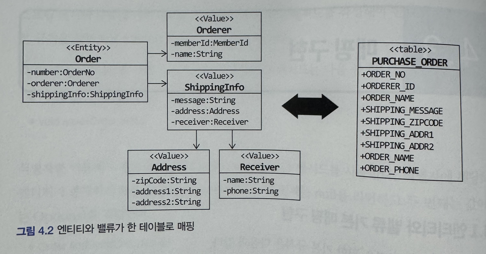

# 4장 리포지토리와 모델 구현

### 모듈 위치

- 리포지토리 인터페이스는 애그리거트와 같이 도메인 영역
- 리포지토리를 구현한 클래스는 인프라스트럭처 영역

도메인 영역

```java
public interface OrderRepository {
	Order findById(OrderNo no);
	void save(Order order);
}
```

인프라스트럭처 영역

```java
public class JpaOrderRepository implements OrderRepository {
	@persistenceContext
	private EntityManager entityManager;

	@Override
	public Order findById(OrderNo id) {
		return entityManager.find(Order.class, id);
	}

	@override
	public void save(Order order) {
		entityManager.persist(order);
	}
}
```

### 리포지토리 기본 기능 구현

```java
public interface OrderRepository {
	Order findById(OrderNo no);
	void save(Order order);
}
```

- 인터페이스는 애그리거트 루트를 기준으로 작성한다.

```java
public class JpaOrderRepository implements OrderRepository {
	@PersistenceContext
	private EntityManager entityManager;

	@override
	public Order findByid(OrderNo id) {
		return entityManager.find(Order.class, id);
	}

	@Override
	public void save(Order order) {
		entityManager.persist(order);
	}
}
```

### 왜 일반적인 JPA와 다르게 구현체와 인터페이스를 나눌까?

일반적이라면

```java
public interface OrderRepository extends JpaRepository<Order, Long>
```

하지만 이경우 도메인 레이어가 JPA, Hibernate에 직접 의존하게 된다.

### 스프링 데이터 JPA를 이용한 리포지토리 구현

```java
@Entity
@Table(name = "purchase_order")
@Access(AccessType.FIELD)
public class Order{
	@EmbeddedId
	private OrderNo number // OrderNo가 식별자

	@Version
	private long version;

	@Embedded
	private Orderer orderer;
	...
}
```

- `@Access(AccessType.FILED)` : JPA가 엔티티의 상태를 읽고/쓰기 할 때 getter/setter가 아니라 필드에 직접 접근한다는 뜻이다.
  - getter를 쓰면 안된다는 의미가 아니다
  - JPA가 영속성 관점에서 접근하는 기준이 필드다
- `@Embeded` : 값 객체(Value Object)를 엔티티에 내장시키는 매핑 방식

```java
@Embeddable
public class Orderer {
	private Memberid memberId;
	private String name;
}
```

### 그러면 왜 값 객체를 사용할까?

- 의미를 타입으로 고정한다.
  - 컴파일 시점에 에러 체크가 가능하다
- 불변성 + 규칙의 캡슐화
  - OrderNo에 예를들어 제약조건이나 특정 조건이 있다면 값 객체에 작성하여 캡슐화가 가능하다
- 나중에 리팩토링될떄 변경이 편하다.

### 엔티티와 벨류 기본 매핑 구현

애그리거트 루트는 엔티티이므로 @Entity로 매핑

밸류는 @Embeddable로 매핑

밸류 타입 프로퍼티는 @Embedded로 매핑

<p align="left">
    
</p>

```java
@Entity
public class Order {
	...
	@Embeded
	private Orderer orderer;

	@Embedded
	private ShippingInfo shippingInfo;
}
```

```java
@Embeddable
public class Orderer {
	@Embedded
	@AttributeOverrides({
           @AttributeOverride(name = "zipCode", column = @Column(name = "shipping_zip_code")),
           @AttributeOverride(name = "address1", column = @Column(name = "shipping_addr1")),
           @AttributeOverride(name = "address2", column = @Column(name = "shipping_addr2"))
  })
  private Address address;
  @Column(name = "shipping_message")
  private String message;
  @Embedded
  private Receiver receiver;
}
```

- address는 @Embedded를 사용하면서 message는 그냥 @Column 을 사용한 이유
  - address의 경우 다시 값 객체로써 하위 클래스가 존재한다.
  - 즉 @Embedded를 사용할 경우 JPA에게 이 필드는 단일 컬럼이 아닌 여러 컬럼으로 구성된 값 객체임을 나타낸다
- 그럼 언제 message도 값 객체로 사용하냐?
  1. 규칙이 생길때
     1. 특정 문자 금지 라던가 이런 규칙이 생긴다면 값객체로서 클래스내에 조건을 작성한다.
  2. 여러 곳에서 재사용될 때
     1. 배송 요청
     2. 반품 요청
     3. 교환 요청
- @AttributeOverrides 는 언제 사용해?
  - 주로 하나의 엔티티에 중복되어 사용된다면 컬럼명을 구분해야할 것이다 이때 사용한다.
  - 예시 코드

  ```java
  @Embedded
  private Address shippingAddress;

  @Embedded
  private Address billingAddress;
  ```

  - 책 예제에서는 물론 한번 사용되었지만 Address 컬럼명을 명확하게 하기위함이다.

### 기본 생성자

JPA를 사용해서 @Entity, @Embeddable로 클래스를 매핑하려면 기본 생성자가 필요하다

`protected Order() {}` 를 통해서 직접 작성

혹은 `@NoArgsConstructor(access = AccessLevel.PROTECTED)` 를 사용한다

### 필드 접근 방식 사용

`@Access` 를 이용해서 명시적으로 접근 방식을 지정하지 않으면 `@Id` 나 `@EmbeddId`의 위치에 따라 접근 방식을 결정한다.

### 애그리거트 로딩전략

JPA 매핑에서 항상 기억할 점은 애그리거트에 속한 객체가 모두 모여야 완전한 하나가 된다는 것이다.

즉 애그리거트 루트를 로딩하면 루트에 속한 모든 객체가 완전한 상태여야 한다.

- @ElementCollection(fetch = FetchType.EAGER)
  - 기본 값이 EAGER이다
  - 값 타입의 경우 @ElementCollection을 통해 즉시로딩되게 설정한다(@Embeddable)

```java
@ElementCollection
private List<Address> address;
```

값 타입의 경우 독립적 존재가 아니며 식별자 또한 없다.

부모와 생명주기를 동일하게 해야하기 때문에 같이 생성, 삭제가 필요하므로 EAGER(기본값)로 해야한다.

- @OneToMany(fetch = FetchType.LAZY)
  - 엔티티 매핑할때는 같은 애그리거트가 아니므로 기본을 LAZY로 활용한다.

### 애그리거트의 영속성 전파

애그리거트가 완전한 상태여야 한다는 것은 **애그리거트 루트를 조회할 때뿐만 아니라 저장하고 삭제할 때도 하나로 처리해야 함**을 의미한다

`@Embeddable` 매핑의 경우 함께 저장되고 삭제되므로 `cascade` 속성을 추가로 설정할 필요가 없다.

`@Entity` 타입에 대한 매핑은 `cascade` 속성을 사용해야한다.

```java
@OneToMany(cascade = {CascadeType.PERSIST, CascadeType.REMOVE}, orphanRemoval = true)
@JoinColumn(name = "product_id")
@OrderColumn(name = "list_idx")
private List<Image> images = new ArrayList<>();
```

### 식별자 생성

크게 3가지 방법

1. 사용자가 직접 생성
2. 도메인 로직으로 생성
3. DB를 이용한 일련번호 사용

### 도메인 구현과 DIP

JPA의 @Entity, @Table 등 JPA에 특화된 어노테이션이 도메인 모델에 의존되는 문제가 발생한다.

하지만 JPA를 사용하다 MyBatis로 바꾼다던가, RDBMS를 사용하다 NoSQL로 간다던가 하는 문제는 거의 없기 때문에 개발 편의성과 복잡도를 높이지 않으면서 기술에 따른 구현 제약이 낮기에 사용한다.
