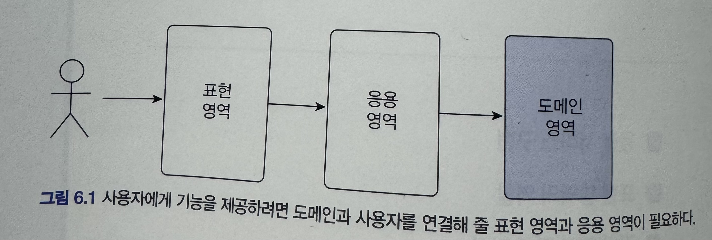

# 6장 응용 서비스와 표현 영역

<p align="left">
    
</p>

### 표현 영역

- 사용자의 요청을 해석한다.
- 응용 서비스가 요구하는 형식으로 사용자 요청을 변환한다.

### 응용영역

- 원하는 기능을 제공하는 것
- 응용 서비스는 기능을 실행하는 데 필요한 입력 값을 메서드 인자로 받고 실행 결과를 리턴한다.

### 응용 서비스 역할

- 사용자의 요청을 처리하기 위해 리포지토리에서 도메인 객체를 가져와 사용한다.
- 응용 서비스가 복잡하다면 응용서비스에서 도메인 로직 일부를 구현한 것인지 확인해야한다.
- 응용 서비스 영역에서는 트랜잭션 범위, 접근 제어, 이벤트 처리가 가능하다.

도메인 로직을 넣지 말라는 예시

```java
public void changePassword(String ...) {
	Member member = memberRepository.findById(memberId);
	checkMemberExists(member);

	//도메인 로직 부분
	if (!passwordEncoder.matches(oldPw, member.getpassword()) {
		throw new BadpasswordException();
	}
	member.setPassword(newPw);
}
```

왜 넣지 말아야 하는가?

1. 코드의 응집성이 떨어진다.
2. 여러 응용 서비스에서 동일한 도메인 로직을 구현할 가능성이 높아진다.

따라서 소프트웨어 가치를 높이려면 도메인 로직을 도메인 영역에 모아서 코드 중복을 줄이고 응집도를 높여야 한다.

### 응용 서비스의 구현

응용 서비스는 표현 영역과 도메인 영역을 연결하는 매개체 역할을 한다(파사드 패턴(`facade`))

### 응용 서비스의 크기

- 한 응용 서비스 클래스에 회원 도메인의 모든 기능 구현하기
- 구분되는 기능별로 응용 서비스 클래스를 따로 두기

2개중 하나의 방법을 선택하면 되는데 필자의 경우 모두 구현하는 방식 보다는 구분되는 기능을 별도의 서비스 클래스로 구성한다.

### 응용 서비스의 인터페이스와 클래스

응용 서비스를 구현할때 인터페이스를 만들고 이를 상속한 클래스를 만들어야 할까?

흔히 `changePassword` 인터페이스와 `changePasswordImpl` 로 구현체 클래스를 나눠서 하는 경우가 있다.

- 런타임 시점에 구현 객체를 교체해야할때
- 응용 서비스는 런타임에 교체하는 경우가 거의 없고 구현 클래스가 2개인 경우도 드물다

런타임 시점에 교체할 필요가 없다면 소스 파일만 많아지고 전체 구조가 복잡해지기에 인터페이스가 명확하게 필요한 경우가 아니라면 지양한다.

### 메서드 파라미터와 값 리턴

응용 서비스의 경우 필요한 값을 표현 계층으로 받아야 한다.

이때 하나의 클래스로 구분할 수도 있고 파라미터로 바로 받을 수있다.

결정하는 기준은 표현 계층에서 응용 계층으로 전달할 파라미터가 2개 이상 혹은 의미 있는 요청이라면 데이터 전달을 위한 별도의 클래스를 사용하는 것이 편리하다(DTO).

### 공부중 갑자기 궁금점 DTO와 DAO의 차이는?

| **구분**     | **DTO**                 | **DAO**               |
| ------------ | ----------------------- | --------------------- |
| 풀네임       | Data Transfer Object    | Data Access Object    |
| 목적         | **계층 간 데이터 전달** | **DB 접근 로직 담당** |
| 주 사용 위치 | Controller ↔ Service    | Service ↔ DB          |
| 상태         | 데이터만 있음           | 데이터 + 로직         |
| 예시         | RequestDto, ResponseDto | Repository, Mapper    |

### 표현 영역에 의존하지 않기

응용 서비스의 파라미터 타입을 결정할 때 주의점은 표현 영역과 관련된 타입을 사용하면 안된다는 것이다.

예를들어 `HttpServletRequest`, `HttpSession`을 응용 서비스에 파라미터로 전달해서는 안된다.

예시 코드

```java
@PostMapping
public String submit(HttpServletRequest request) {
	try {
		//응용 서비스가 표현영역 의존 코드
		changePasswordService.changePassword(request);
	} catch {
	...
	}
}
```

이경우 `request`값이 `HttpServlet` 요청이라는것을 응용 계층이 알게되므로 잘못된 코드이다

해결 방법

- 값을 직접 파라미터로 넘긴다.
- 별도의 클래스(DTO)를 사용한다.

### 값 검증

값 검증의 경우 표현 영역과 응용 서비스 두 곳에서 모두 수행 가능하다.

원칙적으로는 모든 값에 대한 검증은 응용 서비스에서 처리한다.

나눠서 검증 예시

- 표현 영역 : 필수 값, 값의 형식, 범위 등을 검증
- 응용 서비스 : 데이터의 존재 유무와 같은 논리적 오류를 검증

필자의 경우 값 검증, 논리적 오류 모두 응용서비스에서 진행한다.

이유는 응용서비스의 코드가 늘어나는 불편함이 있지만 완성도가 높아지는 장점이 있다.

### 권한 검사

표현 영역에서 할 수 있는 기본적인 검사는 인증된 사용자인지 아닌지를 검사하는 것이다.

이런 접근 제어를 하기에 좋은 위치가 **서블릿 필터**이다.

서블릿 필터에서 사용자의 인증 정보를 생성하고 인증 여부를 검사한다.

예를들어 스프링 시큐리티는 AOP를 활용해서 `@PreAuthorize(”hasRole(’ADMIN’)”)` 과 같은 어노테이션을 통해서 권한 검사가 가능하다.

예시 코드

```java
public class BlockMemberService {
	...
	@PreAuthorize("hasRole('ADMIN')")
	public void block(String memberId) {
		...
	}
}
```
